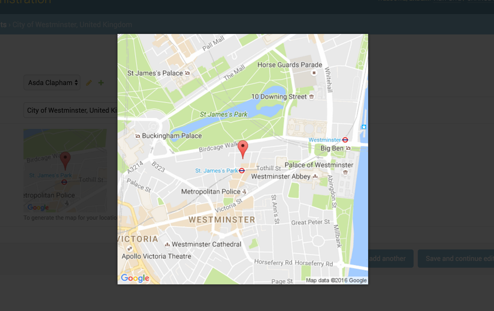

Google Static Map Overlay Widget
================================

**Preview**

This widget is working with `Magnific Popup <http://dimsemenov.com/plugins/magnific-popup/>`_  jQuery plugin.

**Usage**

You can use also all static map features in this widget. Besides you can give a thumbnail_size value.

Here is the all default settings attribute for google static overlay map widget.

.. code-block:: python

    MAP_WIDGETS = {
        "GoogleStaticMapMarkerSettings": (
            ("size", "normal"),
            ("color", ""),
            ("icon", ""),
        ),

        "GoogleStaticOverlayMapWidget": (
            ("zoom", 15),
            ("size", "480x480"),
            ("thumbnail_size", "160x160"),
            ("scale", ""),
            ("format", ""),
            ("maptype", ""),
            ("path", ""),
            ("visible", ""),
            ("style", ""),
            ("language", ""),
            ("region", "")
        ),

        "GOOGLE_MAP_API_SIGNATURE": "",
        "GOOGLE_MAP_API_KEY": "",
    }

**Settings**

In your django ``settings.py`` file, add your ``MAP_WIDGETS`` config:

.. code-block:: python

    MAP_WIDGETS = {
        "GoogleStaticMapWidget": (
            ("zoom", 15),
            ("size", "320x320"),
        ),
        "GoogleStaticMapMarkerSettings": (
            ("color", "green"),
        )
        "GOOGLE_MAP_API_KEY": "<google-map-api-key>"
    }

**Django Admin**

.. code-block:: python

    from mapwidgets.widgets import GoogleStaticMapWidget

    class CityAdmin(admin.ModelAdmin):
        formfield_overrides = {
            models.PointField: {"widget": GoogleStaticMapWidget}
        }

**Django Forms**

.. code-block:: python

    from mapwidgets.widgets import GoogleStaticMapWidget

    class CityDetailForm(forms.ModelForm):

        class Meta:
            model = City
            fields = ("name", "coordinates", "city_hall")
            widgets = {
                'coordinates': GoogleStaticMapWidget,
                'city_hall': GoogleStaticMapWidget(zoom=12, size="240x240"),
            }

