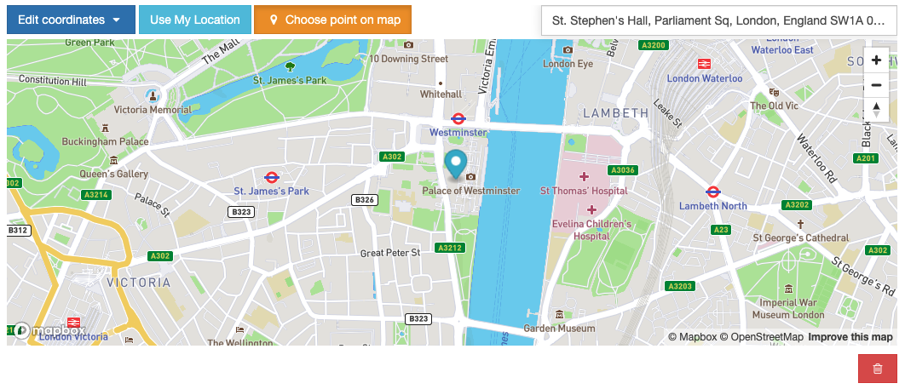

.. _mapbox_point_field_map_widgets:

MapBox Point Field Widget
=========================

Preview
^^^^^^^

Requirements
^^^^^^^^^^^^
**Mapbox Access Token**: To generate an access token, please follow `MapBox account <https://account.mapbox.com/>`_ page instructions.

.. note::

    The widget has a Place Geocoder Autocomplete component by default. You can find a specific address coordinates with it.

.. note::

    The widget has built-in geocoding support. The autocomplete input will be populated by `MapBox geocoding <https://docs.mapbox.com/api/search/geocoding/>`_ API when the user choose a point on the map manually.

Settings
^^^^^^^^

| **access_token**: Put the access token (required)
|
| *default:* ``None``

| **markerFitZoom**: When the marker is initialized google's default zoom is set to Max. This method sets the zoom level a reasonable distance and center the marker on the map.
|
| *default:* ``14``

| **showZoomNavigation**: Whether or not to display the map zoom navigation buttons.
|
| *default:* ``True``

| **mapOptions**: Specify custom map options parameters in ``dict`` type with this attribute, note that, custom options and the widget default options dictionary keys will be merged when the settings loaded. See the full list of map options parameters  `here <https://docs.mapbox.com/mapbox-gl-js/api/map/>`__.
|
| *default*:

.. code-block:: python

    {
        "zoom": 12,
        "style": "mapbox://styles/mapbox/streets-v11",
        "scrollZoom": False,
        "animate": False,
        "center": TIMEZONE_COORDINATES.get(getattr(django_settings, "TIME_ZONE", "UTC"))  # (latitude, longitude),
    }

.. note::

    If mapOptions `center` setting isn't overridden in the project settings file, the widget will be centered the map regarding timezone setting. There is a `list of coordinates <https://docs.mapbox.com/mapbox-gl-js/api/map/>`_ for timezones in the project code.

| **geocoderOptions**: Specify custom geocoder options parameters in ``dict`` type with this attribute, note that, custom options and the widget default options dictionary keys will be merged when the settings loaded. See the full list of geocoder options parameters `here <https://github.com/mapbox/mapbox-gl-geocoder/blob/main/API.md#parameters>`__.
|
| *default*:

.. code-block:: python

    {
        "zoom": 6,
        "flyTo": False,
        "style": "mapbox://styles/mapbox/streets-v11",
        "reverseGeocode": True,
        "marker": False
    }

Usage
^^^^^

**Settings**

Set the widget settings with ``MAP_WIDGETS`` attribute in django settings:

.. code-block:: python

    MAP_WIDGETS = {
        "MapboxPointFieldWidget": {
            "access_token": MAPBOX_ACCESS_TOKEN,
            "markerFitZoom": 12,
            "mapOptions": {
                "animate": True,
                "zoom": 10,
                "center": (51.515618, -0.091998)
            },
            "geocoderOptions": {
                "zoom": 7
            }
        }
    }

Use the widget in Django Admin or Forms:

.. code-block:: python

    from django.contrib.gis import admin
    from mapwidgets.widgets import MapboxPointFieldWidget

    class NeighbourAdmin(admin.ModelAdmin):
        autocomplete_fields = ('neighbour_of_house',)
        formfield_overrides = {
            models.PointField: {"widget": MapboxPointFieldWidget}
        }

.. code-block:: python

    from django.contrib.gis.forms import PointField
    from mapwidgets.widgets import MapboxPointFieldWidget

    class HouseCreateForm(forms.ModelForm):
        location_has_default = PointField(widget=MapboxPointFieldWidget)

        class Meta:
            model = House
            fields = ("name", "location", "location_has_default")
            widgets = {
                "location": GooglePointFieldWidget,
            }

Custom settings can provide individual form fields separately with `settings` as a parameter.

.. code-block:: python

    from django.contrib.gis import forms
    from django.contrib.gis.forms import PointField
    from mapwidgets.widgets import MapboxPointFieldWidget

    FIRST_WIDGET_SETTINGS = {
        "MapboxPointFieldWidget": (
            ("zoom", 15),
            ("mapCenterLocation", [60.7177013, -22.6300491]),
        ),
    }

    SECOND_WIDGET_SETTINGS = {
        "MapboxPointFieldWidget": (
            ("zoom", 15),
            ("mapCenterLocation", [60.7177013, -22.6300491]),
        ),
    }

    class HouseCreateForm(forms.ModelForm):
        location_has_default = PointField(widget=MapboxPointFieldWidget(settings=SINGLE_MAP_SETTINGS))
        location = PointField(widget=MapboxPointFieldWidget(settings=SECOND_WIDGET_SETTINGS))

        class Meta:
            model = House
            fields = ("name", "location", "location_has_default")

Javascript Triggers
^^^^^^^^^^^^^^^^^^^

If you need to develop your map UI on front-end side, you can use map widget jQuery triggers.

* **google_point_map_widget:marker_create**: Triggered when user create marker on map. (callback params: place, lat, lng, locationInputElem, mapWrapID)

* **google_point_map_widget:marker_change**: Triggered when user change marker position on map. (callback params: place, lat, lng, locationInputElem, mapWrapID)

* **google_point_map_widget:marker_delete**: Triggered when user delete marker on map. (callback params: lat, lng, locationInputElem, mapWrapID)

* **google_point_map_widget:place_changed**: Triggered when user update the place via geocoder input. (callback params: place, lat, lng, locationInputElem, mapWrapID)

.. code-block:: javascript

      (function ($){
          $(document).on("mapbox_point_map_widget:marker_create", function (e, lat, lng, locationInputElem, mapWrapID) {
              console.log("EVENT: marker_create"); // django widget textarea widget (hidden)
              console.log(locationInputElem); // django widget textarea widget (hidden)
              console.log(lat, lng); // created marker coordinates
              console.log(mapWrapID); // map widget wrapper element ID
          });

          $(document).on("mapbox_point_map_widget:marker_change", function (e, lat, lng, locationInputElem, mapWrapID) {
              console.log("EVENT: marker_change"); // django widget textarea widget (hidden)
              console.log(locationInputElem); // django widget textarea widget (hidden)
              console.log(lat, lng);  // changed marker coordinates
              console.log(mapWrapID); // map widget wrapper element ID
          });

          $(document).on("mapbox_point_map_widget:marker_delete", function (e, lat, lng, locationInputElem, mapWrapID) {
              console.log("EVENT: marker_delete"); // django widget textarea widget (hidden)
              console.log(locationInputElem); // django widget textarea widget (hidden)
              console.log(lat, lng);  // deleted marker coordinates
              console.log(mapWrapID); // map widget wrapper element ID
          })

          $(document).on("mapbox_point_map_widget:place_changed", function (e, place, lat, lng, locationInputElem, mapWrapID) {
              console.log("EVENT: place_changed"); // django widget textarea widget (hidden)
              console.log(place);  // mapbox geocoder place object
              console.log(locationInputElem); // django widget textarea widget (hidden)
              console.log(lat, lng); // created marker coordinates
              console.log(mapWrapID); // map widget wrapper element ID
          });
      })(jQuery)

Javascript Objects
^^^^^^^^^^^^^^^^^^

The widget JS objects ``mapboxMapObj`` and ``mapboxMapWidgetObj`` can reach out via the map HTML elements using with jQuery `$.data`.
Use jquery selector format like  ``$("#{django-form-field-name}-map-elem")`` in order to get jquery object. See examples in the `demo project templates <https://github.com/erdem/django-map-widgets/blob/master/demo/templates/cities/form.html>`_.
