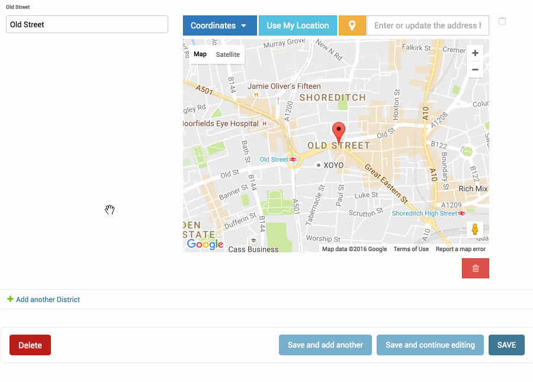

Google Map Widget for Django Admin Inlines
==========================================

**Preview**

As you know, Django Admin has an inline feature where you can add an inline row dynamically. In this case, Django default map widget doesn't initialize widget when created a new inline row.

If you want to use Google Map Widget on admin inlines with no issue, you just need to use ``GooglePointFieldInlineWidget`` class.

.. Note::

    This widget working with :doc:`/widgets/point_field_map_widgets` settings.

**Usage**

.. code-block:: python

    from mapwidgets.widgets import GooglePointFieldInlineWidget

    class DistrictAdminInline(admin.TabularInline):
        model = District
        extra = 3
        formfield_overrides = {
            models.PointField: {"widget": GooglePointFieldInlineWidget}
        }

    class CityAdmin(admin.ModelAdmin):
        inlines = (DistrictAdminInline,)

