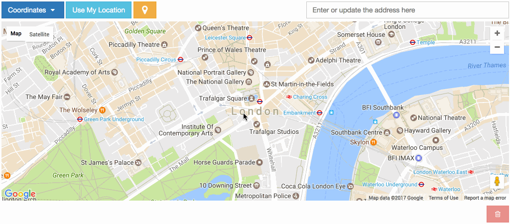

.. _point_field_map_widgets:

Google Map Point Field Widget
=============================

Preview
^^^^^^^

.. Tip::

    The widget has a Google Place Autocomplete widget as a default. You can find a specific address with it.

.. Tip::

    The widget has built-in geocoding support. The autocomplete input will be filled by `google geocoding <https://developers.google.com/maps/documentation/javascript/geocoding/>`_ service when the user adds a marker manually.

Settings
^^^^^^^^

* **GOOGLE_MAP_API_KEY**: Put your Google API key (required)

* **GOOGLE_MAP_API_SIGNATURE**: You can give Google Static Map API signature key (optional). Check out this `page <https://developers.google.com/maps/documentation/static-maps/get-api-key/>`_.

* **LANGUAGE**: Google Map language (optional, default value is ``en``).

* **mapCenterLocationName**: You can give a specific location name for center of the map. Map widget will find this location coordinates using `Google Place Autocomplete <https://developers.google.com/maps/documentation/javascript/examples/places-autocomplete/>`_. (Optional)

* **mapCenterLocation**: You can give specific coordinates for center of the map. Coordinates must be list type. ([latitude, longitude]) (Optional)

* **zoom** : Default zoom value for maps (optional, default value is 6).

* **markerFitZoom** : When the marker is initialized google's default zoom is set to Max. This method sets the zoom level a reasonable distance and center the marker on the map.

Usage
^^^^^

**Settings**

In your ``settings.py`` file, add your ``MAP_WIDGETS`` config:

.. code-block:: python

    MAP_WIDGETS = {
        "GooglePointFieldWidget": (
            ("zoom", 15),
            ("mapCenterLocationName", "london"),
            ("GooglePlaceAutocompleteOptions", {'componentRestrictions': {'country': 'uk'}}),
            ("markerFitZoom", 12),
        ),
        "GOOGLE_MAP_API_KEY": "<google-api-key>"
    }

If you want to give specific location name or coordinates for center of the map, you can update your settings like that.

.. code-block:: python

    MAP_WIDGETS = {
        "GooglePointFieldWidget": (
            ("zoom", 15),
            ("mapCenterLocation", [57.7177013, -16.6300491]),
        ),
        "GOOGLE_MAP_API_KEY": "<google-map-api-key>"
    }

.. code-block:: python

    MAP_WIDGETS = {
        "GooglePointFieldWidget": (
            ("zoom", 15),
            ("mapCenterLocationName", 'Canada'),
        ),
        "GOOGLE_MAP_API_KEY": "<google-map-api-key>"
    }

.. Tip::

    If there is no specific value set for the map center for ``mapCenterLocationName``, ``mapCenterLocation`` the widget will be centred by the timezone setting of the project
    Check out these links.

    * `Timezone Center Locations <https://github.com/erdem/django-map-widgets/blob/master/mapwidgets/constants.py/>`_
    * `countries.json <https://github.com/erdem/django-map-widgets/blob/master/mapwidgets/constants.py/>`_

You can also give specific `settings` as a parameter for each widget.

.. code-block:: python

    from django.contrib.gis import forms
    from mapwidgets.widgets import GooglePointFieldWidget

    CUSTOM_MAP_SETTINGS = {
        "GooglePointFieldWidget": (
            ("zoom", 15),
            ("mapCenterLocation", [60.7177013, -22.6300491]),
        ),
    }

    class CityAdmin(admin.ModelAdmin):
        formfield_overrides = {
            models.PointField: {"widget": GooglePointFieldWidget(settings=CUSTOM_MAP_SETTINGS)}
        }

.. Note::

    `GOOGLE_MAP_API_KEY` must be set in the project Django settings file for custom settings usage.

**Django Admin**

.. code-block:: python

    from mapwidgets.widgets import GooglePointFieldWidget

    class CityAdmin(admin.ModelAdmin):
        formfield_overrides = {
            models.PointField: {"widget": GooglePointFieldWidget}
        }

**Django Forms**

.. code-block:: python

    from mapwidgets.widgets import GooglePointFieldWidget

    class CityAdminForm(forms.ModelForm):
        class Meta:
            model = City
            fields = ("coordinates", "city_hall")
            widgets = {
                'coordinates': GooglePointFieldWidget,
                'city_hall': GooglePointFieldWidget,
            }

Javascript Triggers
^^^^^^^^^^^^^^^^^^^

If you need to develop your map UI on front-end side, you can use map widget jQuery triggers.

* **google_point_map_widget:marker_create**: Triggered when user create marker on map. (callback params: place, lat, lng, locationInputElem, mapWrapID)

* **google_point_map_widget:marker_change**: Triggered when user change marker position on map. (callback params: place, lat, lng, locationInputElem, mapWrapID)

* **google_point_map_widget:marker_delete**: Triggered when user delete marker on map. (callback params: lat, lng, locationInputElem, mapWrapID)

.. code-block:: javascript

    $(document).on("google_point_map_widget:marker_create", function (e, place, lat, lng, locationInputElem, mapWrapID) {
        console.log(place); // google place object
        console.log(locationInputElem); // django widget textarea widget (hidden)
        console.log(lat, lng); // created marker coordinates
        console.log(mapWrapID); // map widget wrapper element ID
    });

    $(document).on("google_point_map_widget:marker_change", function (e, place, lat, lng, locationInputElem, mapWrapID) {
        console.log(place); // google place object
        console.log(locationInputElem); // django widget textarea widget (hidden)
        console.log(lat, lng);  // changed marker coordinates
        console.log(mapWrapID); // map widget wrapper element ID
    });

    $(document).on("google_point_map_widget:marker_delete", function (e, lat, lng, locationInputElem, mapWrapID) {
        console.log(locationInputElem); // django widget textarea widget (hidden)
        console.log(lat, lng);  // deleted marker coordinates
        console.log(mapWrapID); // map widget wrapper element ID
    })

