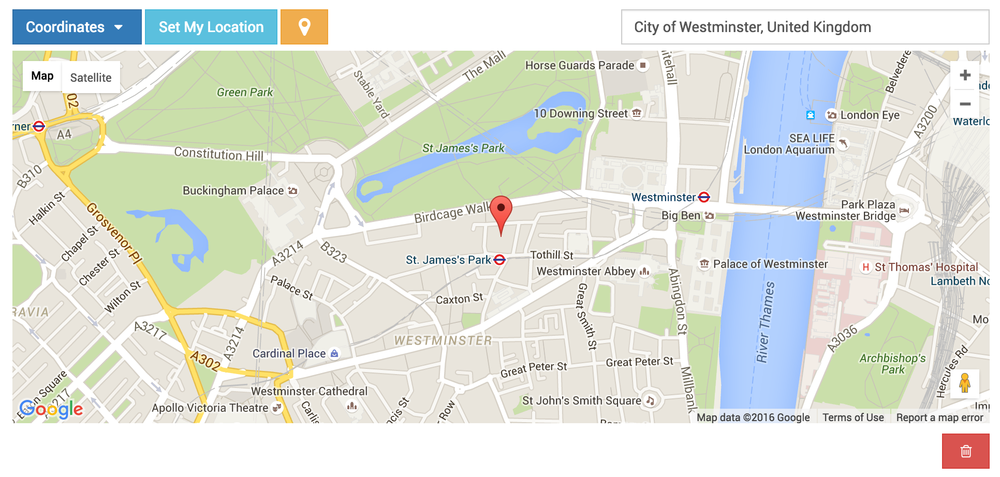

Google Point Field Map Widget
=============================

Preview
^^^^^^^

Settings
^^^^^^^^

* **GOOGLE_MAP_API_KEY**: Put your Google API key

* **mapCenterLocationName**: You can give a specific location name for center of map. Map widget will find this location coordinates using <a href="https://developers.google.com/maps/documentation/javascript/examples/places-autocomplete" target="_blank">Google Places Autocomplete</a>. (Optional)

* **mapCenterLocation**: You can give specific coordinates for center of the map. Coordinates must be list type. ([latitude, longitude]) (Optional)

* **zoom** : Default zoom value.

.. Tip::

    If there is no spesific value set for the map center, (mapCenterLocationName, mapCenterLocation) the widget will be centered by the timezone setting of the project
    Check out these links.

    * `Timezone Center Locations <https://github.com/erdem/django-map-widgets/blob/master/mapwidgets/constants.py/>`_
    * `countries.json <https://github.com/erdem/django-map-widgets/blob/master/mapwidgets/constants.py/>`_

